# Windows PowerShell #

----------

## Agenda ##

- Introduction to PowerShell
- Getting Started with PowerShell
- Core Elements of PowerShell
- Hands on PowerShell 

----------

## Disclaimer ##

I am not a PowerShell expert.

Please take everything you'll see in this document with a grain of salt ;-)

----------

# Introduction to PowerShell #

----------

## What is PowerShell? ##
- Task Automation Framework
- Command-Line Shell and Scripting Language for Windows
- Based on the .NET Framework
- Inspired by UNIX shells and scripting languages such as Perl and Python

**Screenshot of the Windows PowerShell Console 2.0**

----------

# Terminology #

----------

# Shell- vs. Scripting-Languages #

**(Command-Line) Shell**

- A shell is a piece of software that lets you access the functionality provided by the operating system.

**Scripting Languages**

- Scripting languages typically provide more sophisticated features for debugging your scripts and they provide mechanisms for developing larger scripts by letting you break a script into components or modules
- Scripting Language syntax is oriented more towards writing an application than toward interactively issuing commands

----------

### Common features of command-line shells ###

- Read-Evaluate-Print loop (REP)
- Aliases/Shortcuts for long command names
- Wildcard matching, so you don’t have to type the full names of everything
- Call external programs
- Command History

----------

# Examples of command-line shells #

----------

## Examples: UNIX Shells ##

- Bourne-Again Shell (bash)
- Korn Shell (ksh)

----------

## Examples: Windows Shells (1) ##

- Command.com
- Cmd.exe

- PowerShell

----------

## Examples: Windows Shells (2) ##
- Cygwin

----------

## Examples: Browser Shells ##
- Chrome Console

- Firebug Command Line

----------

## Why PowerShell? ##

- "When comparing the command-line manageability of a Windows system to a UNIX system, Windows was found to be limited"
- Windows command line is an inferior technology which cannot compete with the known UNIX Shells
- Windows is known for its Management UIs but lacked an automation framework ?
- "Point and click does not scale"
	- Not across different people
	- Not over time
	- Not across different server environments
	- Not across multiple servers
	- And it is hard to control and to document

----------

## PowerShell Version History ##
- Designed from scratch in 2005
- Version 1.0 was released in 2006 for Windows XP, Windows Server 2003 and Windows Vista. Only optional for Windows Server 2008.
- Version 2.0 is the current version and was released in 2009 for Windows 7, Windows Server 2008 R2

----------

## The Future of PowerShell ##
- PowerShell Version 3.0 is currently a CTP and will be released with Windows Server 8
- The management of Windows Server 8 (Core) will be entirely based on PowerShell
- For the release of Windows Server 8 the number of built-in PowerShell commands (cmdlets) will be increased from 200 to 2300

----------

**Links**

- [Windows Server 8 Developer Preview and PowerShell v3 First Look](http://www.mikepfeiffer.net/2011/09/windows-server-8-developer-preview-and-powershell-v3-first-look/)
- [Microsoft verabschiedet sich vom GUI](http://www.golem.de/1109/86435.html)
- [Powershell dominiert die Server-Verwaltung ab Windows Server 8](http://www.nt4admins.de/themen/verwaltungs-tools/artikel/powershell-dominiert-die-server-verwaltung-ab-windows-server-8.html)

----------

## What is so special about PowerShell? ##

- PowerShell is a new class of object-based shell language - most other shell-languages are string-based
	- PowerShell preserves the structure of the Windows data types by using the .NET object model. No tedious string parsing required
- Command-Line Shell AND Scripting Language in one product - PowerShell's goal is to be both a **good scripting language and a good interactive shell**
- PowerShell leverages the full functionality of the .NET framework
	- You can use all the objects and functions that you know and love from the .NET Framework

----------

# Getting Started with PowerShell #

----------

## Online Resources about PowerShell ##

- [Windows PowerShell Documentation on the MSDN](http://msdn.microsoft.com/en-us/library/windows/desktop/dd835506(v=vs.85).aspx)
- [A list of PowerShell Cmdlets](http://technet.microsoft.com/en-us/library/hh848794.aspx)
- [Scott Hanselman’s PowerShell Posts](http://www.hanselman.com/blog/archives.aspx#PowerShell)
- [PowerGUI: An alternative to the PowerShell ISE](http://powergui.org)
- [Web Administration Cmdlets for Windows PowerShell](http://technet.microsoft.com/en-us/library/ee790599(WS.10).aspx)
- [Microsoft Technet Script Resources](http://gallery.technet.microsoft.com/scriptcenter/)
- [PowerShell Community Extensions](http://pscx.codeplex.com/)
- [Official PowerShell Homepage](http://technet.microsoft.com/en-us/scriptcenter/dd742419.aspx)
- [My Personal PowerShell Bookmark Collection](http://delicious.com/andyk7/powershell)

----------

# Installation & Startup #

----------

## PowerShell Command-Line (1) ##

If you are running a recent version of Windows you will have PowerShell already installed:

> Start > Accessories > Windows PowerShell

----------

## PowerShell Command-Line (2) ##

----------

## PowerShell ISE / Debugger (1) ##

If don’t have the PowerShell debugger installed you can add it via the Windows Features dialog:

> Server Management > Features > Add Feature > "Windows Integrated Scripting Environment (ISE)"

----------

## PowerShell ISE / Debugger (2) ##

----------

## PowerShell Installation Directory ##

The PowerShell executables are located in the folder:

> %windir%\System32\WindowsPowerShell\v1.0

----------

## PowerShell Security Settings (1) ##

By default, PowerShell will not allow you to run scripts. Not external ones and not even your own scripts.

> "The execution policy is part of the security strategy of Windows PowerShell. It determines whether you can load configuration files (including your Windows PowerShell profile) and run scripts, and it determines which scripts, if any, must be digitally signed before they will run."

In order to overcome this restriction we must change PowerShells security policy ("execution policy").

----------

## PowerShell Security Settings (2) ##

In order to be able to run (unsigned) PowerShell scripts and configuration files you need to set the ExecutionPolicy to "RemoteSigned":

	PS> Get-ExecutionPolicy
	
	PS> Set-ExecutionPolicy RemoteSigned

**Links**

- [Micorsoft Technet: Set-ExecutionPolicy](http://technet.microsoft.com/en-US/library/dd347628.aspx)

----------

# Workshop Preparations #

----------

## Configuring Mercurial ##

For this workshop we are going to use Mercurial to distribute the course material and in order to track and exchange changes.

Start PowerShell (Start > Accessories > Windows PowerShell) and enter the following command:

	PS> notepad $Home\Mercurial.ini

Then enter the following text and then save the changes:

	[ui]
	username = Your Name <Your.Name@Domain.com>
	verbose	 = True
	
	[Extensions]
	purge =

----------

## Fetching the workshop material ##

In order to get a copy of the PowerShell workshop material please clone my mercurial repository and create a branch that is named after you.

Start PowerShell

	PS> mkdir $Home\Desktop\dev | Set-Location
	PS> hg clone http://andyk.dyndns-server.com:8000 PowerShell-Workshop
	PS> Set-Location PowerShell-Workshop
	PS> hg branch "YourName"
	PS> hg push --new-branch

----------

# Core Elements of PowerShell #

----------

## Key Points about PowerShell ##

- PowerShell is case insensitive by default.
- PowerShell is object-based. Everything is an object.
- PowerShell is provider based.
- PowerShell supports streaming behaviour.
- You can use all the existing cmd.exe commands you know and love.
- You don’t have to type the full name of every command. Only as much as is required in order to make it distinct.

----------

## Features of the PowerShell console (1) ##

The PowerShell console is based on cmd.exe and has basically the same features, but also some that cmd.exe and other shells are missing:

**Tab Completion**: Enter a command partially and then hit the *TAB*-key in order to let PowerShell complete the command

- For commands
- For wildcards
- For variables
- For object properties
- For functions
- PowerShell providers (Filesystem, IIS, Certificates, Registry, …)
- And you can build your own tab-completion modules.

----------

## Features of the PowerShell console (2) ##

**Evaluation of basic expressions**

**F7 Command History**: As in cmd.exe the <F7> key pops up a command history window

----------

# PowerShell Syntax #

----------

## PowerShell Command Structure ##

A PowerShell command consists of:

- Command Name
- Switch Parameter(s)
- Command Parameter(s)
- Command Argument(s)

----------

## PowerShell Command Syntax ##

PowerShell commands, called cmdlets [speak: command-lets], use verb*-noun pairs in order to be self-descriptive.

> Note: Windows PowerShell uses the term verb to describe a word that implies an action even if that word is not a standard verb in the English language. For example, the term New is a valid Windows PowerShell verb name because it implies an action even though it is not a verb in the English language.

Examples

- Get-Help
- Remove-Item
- Move-Item
- Format-List
- Write-Host

**Links**

- [Verb Naming Rules](http://msdn.microsoft.com/en-us/library/windows/desktop/ms714428(v=vs.85).aspx)

----------

## Common Verbs and their meaning (1) ##

Here is a list of the most common verbs used for PowerShell commands:

<table>
<thead>
<tr><td>Verb</td><td>Description</td><td>Counterpart</td></tr>
</thead>
<tbody>
<tr><td>Add</td><td>Adds a resource to a container, or attaches an item to another item.</td><td>Remove</td></tr>
<tr><td>Clear</td><td>Removes all resources from a container but does not delete the container.</td><td></td></tr>
<tr><td>Close</td><td>Changes the state of a resource to make it inaccessible, unavailable, or unusable.</td><td></td></tr>
<tr><td>Copy</td><td>Copies a resource to another container.</td><td></td></tr>
<tr><td>Enter</td><td>Specifies an action that allows the user to move into a resource.</td><td>Exit</td></tr>
<tr><td>Exit</td><td>Sets the current environment or context to most recently used context.</td><td>Enter</td></tr>
<tr><td>Find</td><td>Looks for an object in a container that is unknown, implied, optional, or specified.</td><td></td></tr>
<tr><td>Format</td><td>Arranges objects in a specified form or layout.</td><td></td></tr>
<tr><td>Get</td><td>Specifies an action that retrieves a resource.</td><td>Set</td></tr>
<tr><td>Hide</td><td>Makes a resource undetectable.</td><td>Show</td></tr>
<tr><td>Join</td><td>Combines resources into one resource.</td><td>Split</td></tr>
<tr><td>Lock</td><td>Secures a resources.</td><td>Unlock</td></tr>
<tr><td>New</td><td>Creates a resource.</td><td></td></tr>
<tr><td>Open</td><td>Changes the state of a resource to make it accessible, available, or usable.</td><td>Close</td></tr>
<tr><td>Pop</td><td>Removes an item from the top of a stack.</td><td>Push</td></tr>
<tr><td>Push</td><td>Adds an item to the top of a stack.</td><td>Pop</td></tr>
</tbody>
</table>

----------

## Common Verbs and their meaning (2) ##

<table>
<thead>
<tr><td>Verb</td><td>Description</td><td>Counterpart</td></tr>
</thead>
<tbody>
<tr><td>Redo</td><td>Resets a resource to the state that was undone.</td><td></td></tr>
<tr><td>Remove</td><td>Deletes a resource from a container.</td><td>Add</td></tr>
<tr><td>Rename</td><td>Changes the name of a resource.</td><td></td></tr>
<tr><td>Reset</td><td>Sets a resource back to its original state.</td><td></td></tr>
<tr><td>Search</td><td>Creates a reference to a resource in a container.</td><td></td></tr>
<tr><td>Select</td><td>Locates a resouces in a container.</td><td></td></tr>
<tr><td>Set</td><td>Replaces data on an existing resource or creates a resources that contains some data.</td><td>Get</td></tr>
<tr><td>Show</td><td>Makes a resource visible to the user.</td><td>Hide</td></tr>
<tr><td>Skip</td><td>Bypasses one or more resources or points in a sequence.</td><td></td></tr>
<tr><td>Split</td><td>Seperates parts of a resource.</td><td>Join</td></tr>
<tr><td>Step</td><td>Moves to the next point or resources in a sequence.</td><td></td></tr>
<tr><td>Switch</td><td>Specifies an action that alternates between two resources, such as to change between two locations, responsibilities, or states.</td><td></td></tr>
<tr><td>Undo</td><td>Sets a resource to its previous state.</td><td></td></tr>
<tr><td>Unlock</td><td>Releases a resource that was locked.</td><td>Lock</td></tr>
<tr><td>Watch</td><td>Continually inspects or monitors a resource for changes.</td><td></td></tr>
</tbody>
</table>

For more examples and PowerShell development guidelines please refer to the MSDN documentation:

- [MSDN Dev Center - Verb naming rules](http://msdn.microsoft.com/en-us/library/windows/desktop/ms714428(v=vs.85).aspx)

----------

## Variables ##

Variables defined by a leading dollar sign ($):

	PS> $someVariable = "Some Content"

All variables can be accessed through a PowerShell provider/drive called "variable:"

	PS> cd variable:
	PS> dir
	PS> get-item someVariable

----------

## Quotes (1) ##

Text in PowerShell is marked by 'single'- or "double"-quotes. If a command name or argument contains whitespace or other special characters, you must wrap the value in single or double quotes. Otherwise the command-interpreter cannot bind the parameters and arguments correctly.

**Missing Quotes**

Missing quotes might lead to errors if the command argument contains whitespace characters:

	PS> Set-Location .\Program Files (x86)

----------

## Quotes (2) ##

**Single Quotes**

	PS> Set-Location '.\Program Files (x86)'

**Double Quotes**

	PS> Set-Location ".\Program Files (x86)"

----------

## Backtick Escape Character (1) ##

Since PowerShell is a Shell that needs to support Windows-style file systems, it cannot use the usual backslash (\) for escaping characters with a special meaning, but uses the backtick character instead (`):

<table>
<thead>
<tr><td>Escape Sequence</td><td>Corresponding Special Character</td></tr>
</thead>
<tbody>
<tr><td>`n</td><td>Newline</td></tr>
<tr><td>`r</td><td>Return</td></tr>
<tr><td>`t</td><td>Tab</td></tr>
<tr><td>`a</td><td>Alert</td></tr>
<tr><td>`b</td><td>&lt;Backspace&gt;</td></tr>
<tr><td>`'</td><td>Single Quote (')</td></tr>
<tr><td>`"</td><td>Double Quote (")</td></tr>
<tr><td>`0</td><td>Null</td></tr>
<tr><td>``</td><td>A single backtick (`)</td></tr>
</tbody>
</table>

**Example: New-Line**

	PS> Write-Host "Line1`nLine2"

----------

## Backtick Escape Character (2) ##

**Example: Tab**

	PS> Write-Host "Key:`tvalue"

**Example: Double Quotes**

	PS> $value = "Lorem Ipsum"
	PS> Write-Host "Key:`"$value`""

----------

## Statement Termination (1) ##

PowerShell has two statement termination characters: the **semicolon** (;) and sometimes the **newline** (\r\n). If the previous text is a syntactically complete statement, a newline is considered to be a statement termination. If it isn’t complete, the newline is simply treated like any other whitespace.

**Example: Defining an array accross multiple lines**

	PS> $someArrayContainingNumbers = @(1,2,
	PS> 3,
	PS> 4,
	PS> 5,6
	PS> ,7
	PS> ,8,
	PS> 9,0)
	PS> 

----------

## Statement Termination (2) ##

**Example: Foreach loop**

	PS> foreach ($number in $someArrayContainingNumbers) {
	PS>	   Write-Host "The Number is: $number"
	PS> }
	PS> 

----------

## Statement Termination (3) ##

**Example: Using expressions and semicolons for multi-line statements**

	PS> $a = (1 + 2) *
	PS> 3
	PS> $b = 4;
	PS> $a + $b
	PS> 

----------

## Statement Termination (4) ##

**Example: Using double quotes to start a multi-line statement**

	PS> Write-Host "Multi-Line:
	PS> Line 1
	PS> Line 2
	PS> Line 3"
	PS>

----------

## Statement Termination (5) ##

**Example: Using the backtick character (`) for bypassing the statement termination**

	PS> Get-ChildItem `
	PS> -Path .\Users\Administrator `
	PS> -Filter *.ini
	PS>

----------

# PowerShell's Built-in Help #

----------

## The Get-Help Command (1) ##

PowerShell has a built-in help command that can provide a lot of information and about the different PowerShell commands and the scripting language itself - just like the Unix [man pages](http://en.wikipedia.org/wiki/Man_page).

<table>
<thead>
<tr><td>Command</td><td>Description</td></tr>
</thead>
<tbody>
<tr><td>get-help *</td><td>Display all available help topics</td></tr>
<tr><td>get-help get-*</td><td>Display all help topics that begin with "get-"</td></tr>
<tr><td>get-help *SomeString*</td><td>Display topics with "SomeString" in the name</td></tr>
<tr><td>get-help set-location</td><td>Displays help about the "set-location" cmdlet</td></tr>
<tr><td>get-help set-location -examples</td><td>Displays examples on how to use the "set-location" cmdlet</td></tr>
<tr><td>get-help set-location -detailed</td><td>Display additional information about a cmdlet, including descriptions of the parameters and examples of using the cmdlet.</td></tr>
<tr><td>get-help set-location -full</td><td>Display the entire help file for a cmdlet, including technical information about the parameters.</td></tr>
<tr><td>get-help about*</td><td>Display conceptual help topics</td></tr>
<tr><td>get-help about_functions</td><td>Displays conceptual help about "functions"</td></tr>
<tr><td>get-help about_switch</td><td>Display conceptual help about "switch" statements</td></tr>
</tbody>
</table>

----------

## The Get-Help Command (2) ##

	PS> get-help

----------

## The Get-Help Command (3) ##

Using the get-help command together with the "-examples" switch to display some example usages of the "set-location" cmdlet:

	PS> get-help set-location -examples

----------

## The Get-Help Command (4) ##

The PowerShell Get-Help cmdlets returns objects not just plain text, but full help objects on which you can access any property you like:

	PS> (get-help set-location) | Get-Member

----------

## The Get-Help Command (5) ##

Using the "syntax" property of an help object to display only the syntax section of a help result: 

	PS> (get-help set-location).Syntax

----------

# PowerShell Commands #

----------

## Command Types ##

There are four kinds of command Windows PowerShell can execute:

1.	**Cmdlets** [command-lets] 
.NET programs that are designed for PowerShell
2.	**Scripts** (*.ps1) 
Scripts/Functions that live on the disk
3.	**Functions** 
Scripts/Function that live only in memory
4.	**Executables** 
All executable programs that are accesible through the [PATH](http://en.wikipedia.org/wiki/PATH_(variable)) variable (e.g. notepad.exe)

----------

## Common Commands/Cmdlets ##

The most common commands/cmdlets are the ones you would also use to in your classical Windows cmd.exe command line:

- **dir** (get-childitem)
- **cd** (set-location)
- **copy** (copy-item)
- **move** (move-item)
- **del** (remove-item)

----------

## Retrieving a list of Commands (1) ##

In order to to get full list of all available comands you can use the "get-command" cmdlet:

	PS> get-command

----------

## Retrieving a list of Commands (2) ##

You can also use wildcards to search for commands for specific commands.

**Get all commands that start with "write-":**

	PS> get-command write-*

----------

## Retrieving a list of Commands (3) ##

**Get all commands that have the term "item" in the name:**

	PS> get-command *item*

----------

# Command Aliases #

----------

## Command Aliases (1) ##

Since most of these command name are all following the verb-noun syntax, they are **self-explanatory** but also kind of **verbose**.

**Examples of verbose commands:**

- Set-Location
- Where-Object
- Remove-Item
- Foreach-Object
- Select-Object
- Get-ChildItem
- ...

And thats why PowerShells comes with a large set of predefined aliases.

----------

## Command Aliases (2) ##

Comand aliases are **concise** shortcuts to existing commands that enable you

- use the command names you know and love (**transitional aliases** such as cd, mkdir, ...)
- to get your work done fast (**convenience aliases** such as gc for get-content, sel instead of select-object)

----------

## Command Aliases (3) ##

These are some of the alias that are used frequently:

<table>
<thead>
<tr><td>Alias</td><td>Command</td><td>Alias Type</td></tr>
</thead>
<tbody>
<tr><td>cd</td><td>Set-Location</td><td>Transitional (Windows)</td></tr>
<tr><td>dir</td><td>Get-ChildItem</td><td>Transitional (Windows)</td></tr>
<tr><td>ls</td><td>Get-ChildItem</td><td>Transitional (UNIX)</td></tr>
<tr><td>cls</td><td>Clear-Host</td><td>Transitional (Windows)</td></tr>
<tr><td>gc</td><td>Get-Content</td><td>Convenience</td></tr>
<tr><td>type</td><td>Get-Content</td><td>Transitional (Windows)</td></tr>
<tr><td>cat</td><td>Get-Content</td><td>Transitional (UNIX)</td></tr>
<tr><td>mkdir</td><td>New-Item -type directory</td><td>Transitional (Windows)</td></tr>
<tr><td>rm</td><td>Remove-Item</td><td>Convenience</td></tr>
<tr><td>del</td><td>Remove-Item</td><td>Transitional (Windows)</td></tr>
<tr><td>rmdir</td><td>Remove-Item</td><td>Transitional (Windows)</td></tr>
<tr><td>copy</td><td>Copy-Item</td><td>Transitional (Windows)</td></tr>
<tr><td>cp</td><td>Copy-Item</td><td>Transitional (Unix)</td></tr>
<tr><td>fm</td><td>Format-List</td><td>Convenience</td></tr>
<tr><td>gm</td><td>Get-Member</td><td>Convenience</td></tr>
<tr><td>foreach</td><td>Foreach-Object</td><td>Convenience</td></tr>
<tr><td>where</td><td>Where-Object</td><td>Convenience</td></tr>
</tbody>
</table>

----------

## Command Aliases (4) ##

To get a full list of all aliases use the **get-alias** command:

	PS> get-alias

----------

## Command Aliases (5) ##

For getting all aliases for a specific command use the *definition*-parameter for the *get-alias* command:

	PS> get-alias -definition Remove-Item

If you need more background information about PowerShell aliases, please refer to the PowerShell online help:

	PS> get-help about_aliases

	PS> get-help get-alias

----------

## Command Aliases (6) ##

**Elastic Syntax**

The idea of the command aliases is that PowerShell can be terse when needed and descriptive when appropriate.
The syntax is concise for simple cases and can be stretched like an elastic band for larger problems.

This is important in a language that is both a command-line tool and a scripting language.

**Rules for using command aliases **

- Don't use command aliases when you are scripting.
- Only use command aliases, when you need to get work done in the command-line 
(and nobody but yourself needs to understand what you are doing).

----------

# PowerShell Providers #

----------

## PowerShell Providers (1) ##

PowerShell providers are .NET programs that make serialized data available through a **filesystem-drive like format**.
These drives are called **PowerShell Drives** or short **PSDrives**.

- Filesystem like navigation through data and components
- Reuse of the same cmdlets that are used for file system drives (set-location, get-childitem, new-item, remove-item, move-item, ...)
- Universal support for wildcards

----------

## PowerShell Providers (2) ##

Windows PowerShell comes with a number of built-in providers / PowerShell drives that you can use to access many different types of data stores.

<table>
<thead>
<tr><td>Provider</td><td>Drive</td><td>Data Store</td></tr>
</thead>
<tbody>
<tr><td>Alias</td><td>Alias:</td><td>Windows PowerShell aliases</td></tr>
<tr><td>Certificate</td><td>Cert:</td><td>x509 certificates for digital signatures</td></tr>
<tr><td>Environment</td><td>Env:</td><td>Windows environment variables</td></tr>
<tr><td>FileSystem</td><td>C:, D:, ...</td><td>File system drives, directories, and files</td></tr>
<tr><td>Function</td><td>Function:</td><td>Windows PowerShell functions</td></tr>
<tr><td>Variable</td><td>Variable:</td><td>Windows PowerShell variables</td></tr>
<tr><td>Registry</td><td>HKLM:, HKCU</td><td>Windows registry</td></tr>
</tbody>
</table>

**Example: Navigation to the "Variable"-drive**

	PS C:\Users\Administrator> cd variable:
	PS Variable:\> dir

----------

## PowerShell Providers (3) ##

You can retrieve a list of all available PowerShell **providers** with the *Get-PSProvider* command:

	PS> get-psprovider

----------

## PowerShell Providers (4) ##

You can retrieve a list of all available PowerShell **drives** with the *Get-PSDrive* command:

	PS> get-psdrive

----------

## PowerShell Providers (5) ##

These are the cmdlets that will work for any PowerShell provider / drive.

- **Childitem cmdlets** 
Get-ChildItem
- **Content cmdlets** 
Add-Content, Clear-Content, Get-Content, Set-Content
- **Item cmdlets** 
Clear-Item, Copy-Item, Get-Item, Invoke-Item, Move-Item, New-Item, Remove-Item, Rename-Item, Set-Item
- **Item Property cmdlets** 
Clear-ItemProperty, Copy-ItemProperty, Get-ItemProperty, Move-ItemProperty, New-ItemProperty, Remove-ItemProperty, Rename-ItemProperty, Set-ItemProperty
- **Location cmdlets** 
Get-Location, Pop-Location, Push-Location, Set-Location
- ** Path cmdlets** 
Join-Path, Convert-Path, Split-Path, Resolve-Path, Test-Path

----------

# Pipelines #

----------

## Pipelines (1) ##

A pipeline is a series of commands connected by pipeline operators (|).
Each pipeline operator sends the results of the preceding command to the next command.

Send the **objects** that are returned by one command to be used as input to another command:

	PS> Command-1 | Command-2 | Command-3

Each command in the pipeline receives an object from the previous command, performs some operation on
it, and then passes it along to the next command in the pipeline.

----------

## Pipelines (2) ##

**Example: Formatting the results of the Get-ChildItem cmdlet**

Sending the results of the dir/get-childitem command directly to the format-table command - displaying only the file name and the directory of the found files.

	PS> dir -Recurse -Filter *.ps1 | Format-Table Name,Directory

----------

## Pipelines (3) ##

**Example: Filtering the result of the Get-Process cmdlet**

Using the Where-Object cmdlet to display only the process with the desired name (e.g. "chrome").

	PS> Get-Process | Where-Object { $_.ProcessName -eq "chrome" }

----------

# Output Redirection #

----------

## Output Redirection ##

By default, Windows PowerShell sends all output to the console, but like all shell languages PowerShell has the ability to **direct the output to a text file** instead.

- output redirection
	- Use the ">" operator to write the output directly to a file
	- Use the ">>" operator to **append** the output to a file
- error redirection
	- Use the "2>" operator to write **errors** to a file
	- Use the "2>>" operator to **append** errors to a file
	- Use the "2>&1" operator to write error messages to the output pipe instead of the error pipe

----------

# Output Redirection Example #

----------

## Output Redirection: Example (1) ##

Content of *myScript.ps1*

	$fileName = "test.txt"
	
	
	"Fetching file (`$fileName = $fileName)."
	if (!(Test-Path $fileName))
	{
	    "This will cause an error, because a file with the
	    name '$fileName' does not exist in the current folder"
	}
	
	Get-Item $fileName

----------

## Output Redirection: Example (2) ##

	PS> .\myScript.ps1

When you execute the script "someScript.ps1" you will get a result which looks something like you can see in the screenshot above:

1. The **message** "Fetching file ..."
2. The **message** "This will cause an error ..." because the file "test.txt" does not exist
3. An **error** caused by the *get-item* command

----------

## Output Redirection: Example (3) ##

Now you can redirect the output of the script to a file with the ">" operator:

	PS> .\someScript.ps1 > ..\output-of-someScript.txt

- Only the output is redirected to the the text file
- The error message is printed to the console window

----------

# Error Redirection Example #

----------

## Error Redirection: Example (1) ##

In order to redirect only the error messages to a file you can use the "2>" operator:

	PS> .\someScript.ps1 2> ..\output-of-someScript.txt

- Only the error is redirected to the the text file
- The message output is printed to the console window

----------

## Error Redirection: Example (2) ##

With the "2>&1" operator you can force PowerShell to redirect error messages to the normal success-output-stream.

	PS> .\someScript.ps1 > ..\output.txt

----------

## Error Redirection: Example (3) ##

Output that would normally be redirected to the console window (error stream) is now treated as if it was normal output and is sent to the success stream (output.txt):

	PS> .\someScript.ps1 > ..\output.txt 2>&1

----------

## Output Redirection vs. Pipelines ##

**Whats is the difference between Pipelining and Output Redirection?**

- Output redirection is specifically for files and not for commands
- There is no (real) difference between piping and redirection
- Output redirection with the redirection operators (>, >>) are **syntactic sugar** for something you would otherwise accomplish with a pipe character (|) and the *out-file* cmdlet.
- **Note:** Error redirection cannot be done as easily with pipelines.

**Pipeline equivalent for the > Operator**

	PS> someScript.ps1 > output.txt

	PS> someScript.ps1 | Out-File -Path output.txt

**Pipeline equivalent for the >> Operator**

	PS> someScript.ps1 >> output.txt

	PS> someScript.ps1 | Out-File -Path output.txt -Append

----------

## Output Redirection: Resources ##

Resources about output- and error-redirection and pipelines:

- [get-help about_Redirection](http://technet.microsoft.com/en-us/library/dd315283.aspx)
- [get-help about_Pipelines](http://technet.microsoft.com/en-us/library/dd347624.aspx)
- [get-help out-file](http://technet.microsoft.com/en-us/library/dd315303.aspx)

----------

# Variables #

----------

## Variables: Overview (1) ##

A variable is a unit of memory in which values are stored.

- Variables are represented by single-word text strings that begin with the dollar sign ($), and can contain any alphanumeric characters as well as underscores [a-z0-9_!?öäüéèß ...]

	Examples:

	$a, $process, $my_var, $müsli, $straße

- If you want to define variables with special characters (whitespace, dash, ...) in its name you have to use this syntax:

	${This is söme spécial! variable-name} = "Some Value"

- Variables can store any type of object (integers, strings, arrays, hash tables, ...)

----------

## Variables: Overview (2) ##

- There is no such thing as an uninitialized variable
	- PowerShell variables are not declared; they are just created as need on first assignment
	- If you reference a variable that does not exist yet, the system will return the value $null (unlike JavaScript)
- All variables are accessible via a "Variable" PowerShell Provider / PowerShell Drive
- There are three different types of variables in Windows PowerShell:
	1. User-created variables 
	2. Automatic variables
	3. Preference variables

----------

## User-created variables ##

- User-created variables are only available in the session in which you create them
- If you want a certain variable in every PowerShell session you have to add the variable to your PowerShell profile ($profile)
- You can also created variables with global, script, or local scope

----------
## Automatic Variables ##

Automatic variables are created by Windows PowerShell and are used to store its state.

<table>
<thead>
<tr>
	<td>Variable</td>
	<td>Description</td>
</tr>
</thead>

<tbody>
<tr>
	<td>$$</td>
	<td>Contains the last token in the last line received by the session.</td>
</tr>

<tr>
	<td>$?</td>
	<td>Contains the execution status of the last operation. It contains TRUE if the last operation succeeded and FALSE if it failed.</td>
</tr>

<tr>
	<td>$^</td>
	<td>Contains the first token in the last line received by the session.</td>
</tr>

<tr>
	<td>$_</td>
	<td>Contains the current object in the pipeline object.</td>
</tr>

<tr>
	<td>$Args</td>
	<td>Contains an array of the undeclared parameters and/or parameter values that are passed to a function, script, or script block.</td>
</tr>

<tr>
	<td>$Error</td>
	<td>Contains an array of error objects that represent the most recent errors.</td>
</tr>

<tr>
	<td>$False</td>
	<td>Contains FALSE.</td>
</tr>

<tr>
	<td>$ForEach</td>
	<td>Contains the enumerator of a ForEach-Object loop.</td>
</tr>

<tr>
	<td>$Home</td>
	<td>Contains the full path of the user's home directory.</td>
</tr>

<tr>
	<td>$Host</td>
	<td>Contains an object that represents the current host application for Windows PowerShell.</td> 
</tr>

<tr>
	<td>$LastExitCode</td>
	<td>Contains the exit code of the last Windows-based program that was run.</td>
</tr>

<tr>
	<td>$Matches</td>
	<td>The $Matches variable works with the -match and -not match operators.</td>
</tr>

<tr>
	<td>$MyInvocation</td>
	<td>Contains an object with information about the current command, such as a script, function, or script block.</td>
</tr>

<tr>
	<td>$NULL</td>
	<td>Contains a NULL or empty value.</td>
</tr>

<tr>
	<td>$PID</td>
	<td>Contains the process identifier (PID) of the process that is hosting the current Windows PowerShell session.</td>
</tr>

<tr>
	<td>$Profile</td>
	<td>Contains the full path of the Windows PowerShell profile for the current user and the current host application.</td>
</tr>

<tr>
	<td>$PsHome</td>
	<td>Contains the full path of the installation directory for Windows PowerShell, typically, %windir%\System32\WindowsPowerShell\v1.0.</td> 
</tr>

<tr>
	<td>$Pwd</td>
	<td>Contains a path object that represents the full path of the current directory.</td> 
</tr>

<tr>
	<td>$This</td>
	<td>In a script block that defines a script property or script method, the $This variable refers to the object that is being extended.</td> 
</tr>

<tr>
	<td>$True</td>
	<td>Contains TRUE. You can use this variable to represent TRUE in commands and scripts.</td>
</tr>
</tbody>
</table>

----------

## Preference Variables ##

Windows PowerShell includes a set of variables that enable you to customize its behavior. These "preference variables" work like the     options in GUI-based systems.

**Example: $OFS - The Default Space Character**

By default the $OFS variable is set to a single whitespace character (" "):

	PS> $data = 1,2,3,4,5,6,7,8,9
	PS> [string] $data
	1 2 3 4 5 6 7 8 9

But you can change the value if you like:

	PS> $OFS = ","
	PS> $data = 1,2,3,4,5,6,7,8,9
	PS> [string] $data
	1,2,3,4,5,6,7,8,9

For more information about preference variables use the PowerShell help:
	
	PS> get-help about_Preference_Variables

----------

## Working with Variables (1) ##

Use the *get-variable* cmdlet to get a list of all variables in your current PowerShell session:

	PS> get-variable

----------

## Working with Variables (2) ##

Use wildcards for the *get-variable* cmdlet to search for variables:

	PS> get-variable p*

	PS> get-variable -Name p* -Exclude ps*

----------

## Working with Variables (3) ##

Use can use the **Variable PowerShell Provider** to access variables.

	PS C:\Users\Administrator> set-location variable:
	PS Variable:\> dir

----------

## Working with Variables (4) ##

You can use the **Environment PowerShell Provider** to access the variables from the $env scope:

	PS C:\Users\Administrator> set-location Env:
	PS Env:\> dir

----------

## Working with Variables (5) ##

Or you can access environment variables with their **scope modifier** "$env:<variablename>".

	PS C:\Users\Administrator> set-location $env:SystemRoot
	PS C:\Windows\>

----------

## Variables: Resources ##

- [get-help about_Variables](http://technet.microsoft.com/en-us/library/dd347604.aspx)
- [get-help about_Automatic_Variables](http://technet.microsoft.com/en-us/library/dd347675.aspx)
- [get-help about_Preference_Variables](http://technet.microsoft.com/en-us/library/dd347731.aspx)
- [get-help about_Scopes](http://technet.microsoft.com/en-us/library/dd315289.aspx)

----------

# Operators #

----------

## Arithmetic Operators ##

- Addition (2+2)
- Multiplication (2*2)
- Subtraction (2-1)
- Dividation (10 / 5)
- Modulus (7 % 4)

----------

## Assignment Operators ##

PowerShell supports all the compound operators that are found in C-based languages such as C#.

- Assignment ($a = 3)
- Addition ($a += 2)
- Subtraction ($a -= 1)
- Multiplication ($a *= 2)
- Dividation ($a /= 2)
- Modulus ($a %= 3)

----------

## Comparion Operators ##

These are the comparison operators that are supported by PowerShell.

- Equals (-eq)
- Not Equals (-neq)
- Greater Than (-gt)
- Less than (-lt)
- Collection contains value (-contains)
- Collection does not contain value (-notcontains)

By default, all of these operators are **case insensitive**. But there is also and case sensitive versions for each operator.
For more information please refer to the help section:

- [get-help about_Comparison_Operators](http://technet.microsoft.com/en-us/library/dd315321.aspx)

----------

## Pattern Matching Operators ##

**Wildcards**

- String matches wildcard pattern (-like)
- String does not match wildcard pattern (-notlike)

**Regular Expression Matching**

- String matches regular expression (-match)
- String does not match regular expression (-notmatch)

**Regular Expression Replacement**

- Regular expression subscript substitution (-replace)

----------

# Flow Control #

----------

## If/Else ##

tbd

----------

## Switch ##

tbd

----------

## Loops ##

tbd

----------

# Fuctions #

----------

## Streaming ##

----------

# Types #

----------

## Using .NET Types ##

	PS> (new-object System.Net.WebClient).DownloadString("http://www.google.com")

----------

# Scripts #

----------

# Errors and Exceptions #

----------

# Lessons #

----------

## Working with files and folders ##

tbd

----------

## Parsing Text Files ##

e.g. parsing log files

----------

## Accessing SQL Databases ##

tbd

----------

## Using the Web Administration Module ##

- Recycling an App Pool
- Stopping a website
- Enabling Maintenance

----------

## Writing a custom Cmdlet ##

tbd

----------

## Creating a customer PowerShell Drive ##

tbd

----------

## Debugging with PowerShell ISE ##

tbd

----------

## Using .NET DLLs ##

- CacheWarmup Tool
- Commerce Server Connection String Switcher

----------

## Installing the Community Extensions (1) ##

The [PowerShell Community extensions](http://pscx.codeplex.com/) (PSCX) are a PowerShell module that adds a lot of useful cmdlets to PowerShell:

- **Edit-File**: Opens the specified text file in a text editor
- **Show-Tree**: Shows the specified path as a tree
- **Out-Speech**: Outputs text as spoken words
- **Enable-OpenPowerShellHere**: Creates the registry entries required to create Windows Explorer context menu "Open PowerShell Here" for both Directories and Drives
- **Format-Xml**: Pretty print XML
- **Write-Zip**: Creates an ZIP Archive from the pipeline input
- **New-Junction**: Creates an NTFS directory junction link (just like mklink.exe)
- **Out-Clipboard**: Formats text via Out-String before placing in clipboard. Can also place string in clipboard as a file.

and many more ...

----------

## Installing the Community Extensions (2) ##

**Instructions**

1. Create a PowerShell Profile if you don’t have one yet

	if ((Test-Path $Profile) -eq $false)
	{
		New-Item $Profile -Type file -Force | Out-Null
	}
	
	explorer (Split-Path $profile -parent)

2. Extract the PSCX archive (“Pscx-2.0.0.1.zip”) into your PowerShell Profile Directory

	C:\Users\Administrator\Documents\WindowsPowerShell\Modules

3. Add an import statement to your PowerShell profile

	Import-Module Pscx -arg "$(Split-Path $profile -parent)\Modules\Pscx\Pscx.UserPreferences.ps1"

4.	Restart PowerShell

----------

## Installing the Community Extensions (3) ##

Take the PowerShell Community Extension for a spin:

- Use the Edit-File command
- Use the clipboard commands and format-xml for formatting XML in memory
- Enable the PowerShell Context Menu entry
- Create a Zip-Archive
- Use the Set-LocationEx command to remeber your previous location
- Use the new-junktion command to create symbolic filesystem references

**Links**

- [PowerShell Community Extensions (PSCX)](http://pscx.codeplex.com/documentation)

----------

## Reading/Writing XML with PowerShell (1) ##

PowerShell supports XML documents as a primitive data type.

**Sample XML**

	<Settings>
		<Entry id="1">Value 1</Entry>
		<Entry id="2">Value 2</Entry>
		<Entry id="3">Value 3</Entry>
	</Settings>

**Reading XML**

	[xml] $xml = Get-Content sample.xml
	foreach ($setting in $xml.Settings.Entry)
	{
		Write-Host "$($setting.psbase.InnerText) (Id: $($setting.Id))"
	}

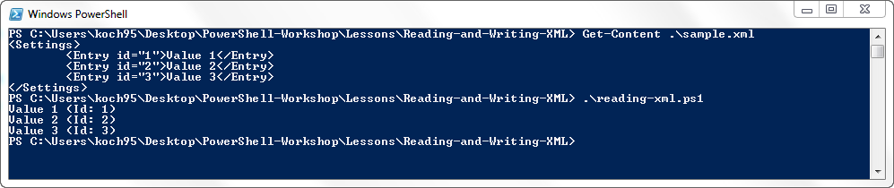

----------

## Reading/Writing XML with PowerShell (2) ##

**Writing XML**

	# Read XML
	[xml] $xml = Get-Content sample.xml
	
	# Create new node
	$newEntry = $xml.CreateElement("Entry")
	$newEntry.psbase.InnerText = "Value 4"
	
	# Create new node attribute
	$idAttribute = $xml.CreateAttribute("id")
	$idAttribute.psbase.Value = "4"
	
	# Assign new attribute to new node
	$newEntry.SetAttributeNode($idAttribute)
	
	# Append new node
	$xml.Settings.AppendChild($newEntry)
	
	# Save XML (Note: Use absolute paths for XML.Save())
	$targetFile = Join-Path "$(Get-Location)" "sample-extended.xml"
	$xml.save($targetFile)

----------

## Reading/Writing XML with PowerShell (3) ##

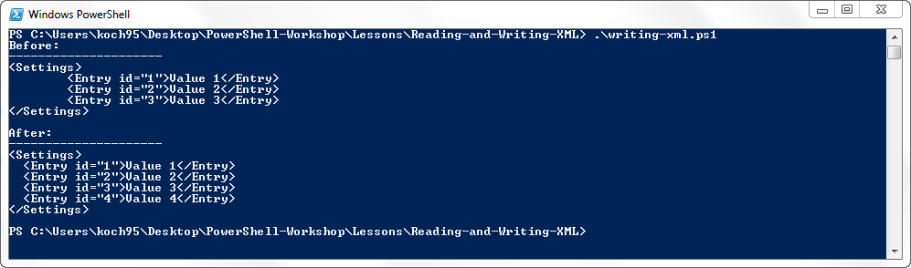

----------

## Signing PowerShell Scripts ##

tbd

----------

## Automating Visual Studio with PowerConsole ##

tbd

----------

## Creating a custom open-folder command ##

tbd

----------

## Opening the current folder in the explorer ##

tbd

----------

# Customizing the PowerShell Console #

----------

## Customizing the PowerShell Console (1) ##

Since PowerShell is hosted in the same console windows as the good old *cmd.exe*, it will look exactly like good old *cmd.exe* if you start it using the *PowerShell.exe*.

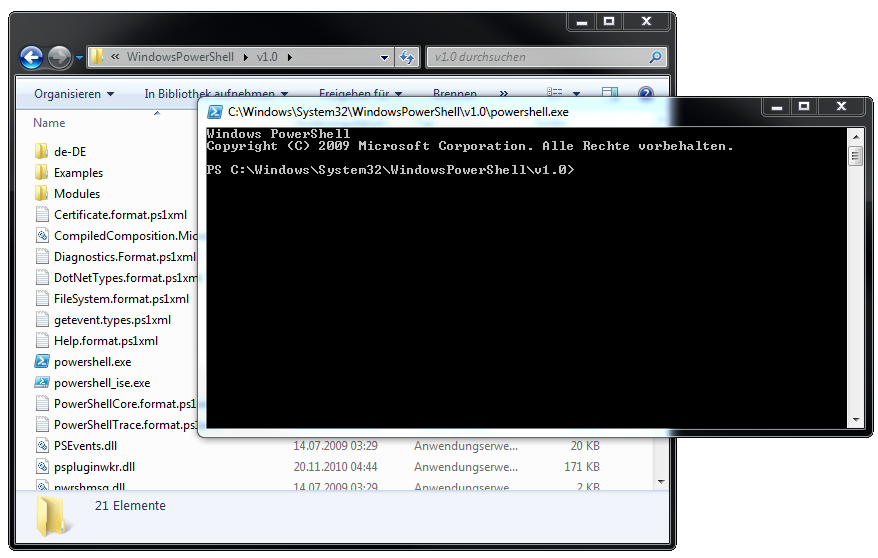

----------

## Customizing the PowerShell Console (2) ##

If you want the same look and feel you get, if you open the PowerShell from a shortcut or your Windows start menu ...

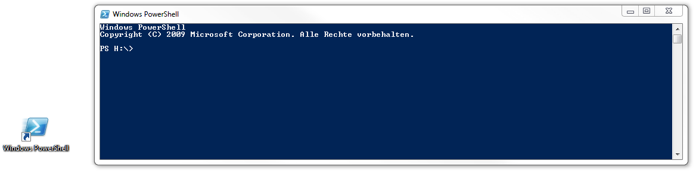

... you can assign your desired console window style in your personal PowerShell profile.

----------

## Customizing the PowerShell Console (3) ##

Open your PowerShell profile in a text editor:

	PS> notepad $profile

Then add the following code to your PowerShell profile:

	$consoleUi = (Get-Host).UI.RawUI
	
	# Set Colors
	$consoleUi.BackgroundColor = "DarkBlue"
	$consoleUi.ForegroundColor = "White"
	
	# Set Window Size
	$width = 120
	$height = 50
	
	$consoleBufferSize = $consoleUi.BufferSize
	$consoleBufferSize.Width = $width + 10
	$consoleBufferSize.Height = $height * 10
	$consoleUi.BufferSize = $consoleBufferSize
	
	$consoleWindowSize = $consoleUi.WindowSize
	$consoleWindowSize.Width = $width
	$consoleWindowSize.Height = $height
	$consoleUi.WindowSize = $consoleWindowSize
	
	# Set Window Title
	$consoleUi.WindowTitle = "PowerShell"
	
	# Apply Changes
	Clear-Host

----------

## Customizing the PowerShell Console (4) ##

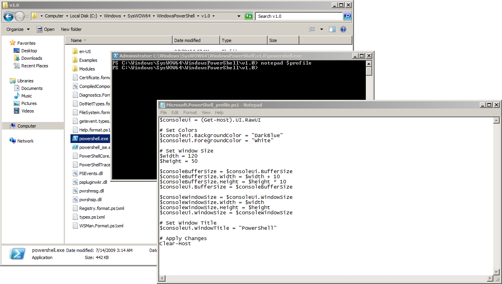

----------

## Customizing the PowerShell Console (5) ##

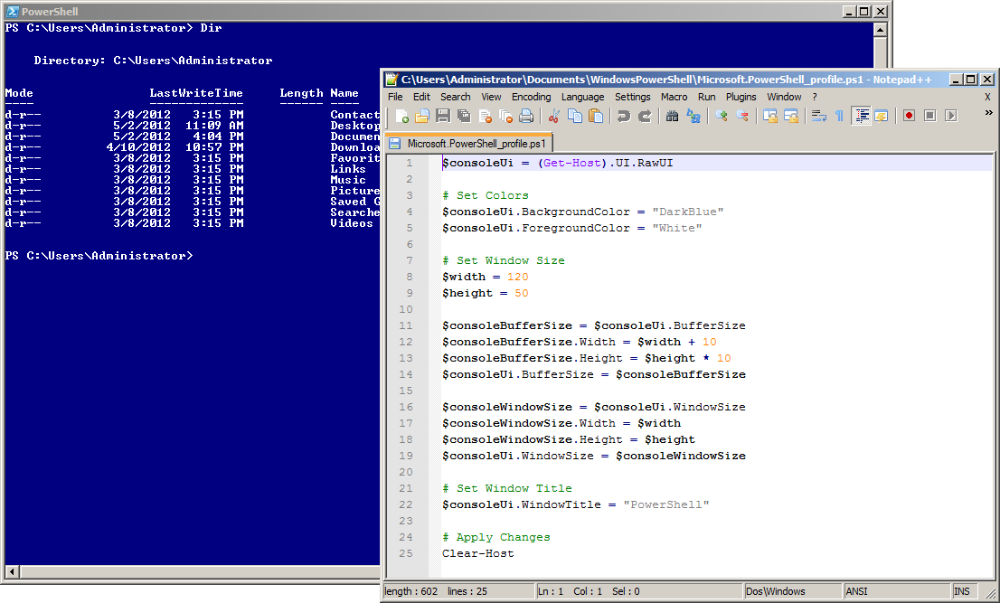

----------

# Creating functions for accessing the Clipboard #

----------

## Clipboard access (1) ##

In this lesson we are going to extend your personal PowerShell profile with function for reading and writing from and to the clipboard.

**What it the PowerShell Profile**

The Windows PowerShell profile is simply a script file that runs when you start Windows PowerShell. All functions defined in this script will be automatically available in your new PowerShell session.
The location of your PowerShell profile is stored in the $PROFILE variable:

	PS> $profile
	C:\Users\Administrator\Documents\WindowsPowerShell\Microsoft.PowerShell_profile.ps1

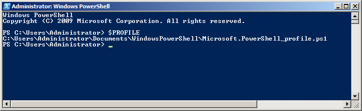

----------

## Clipboard access (2) ##

You can edit your profile script by entering:

	PS> notepad $profile

In case you don’t have a profile script you will get a message like this:

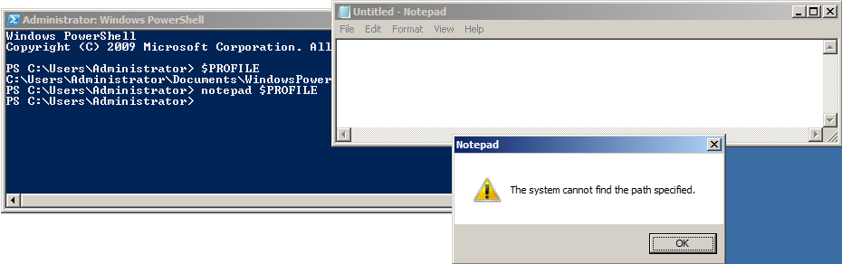

----------

## Clipboard access (3) ##

In order to create the profile script and open it with notepad enter this command:

	PS> notepad (New-Item $PROFILE -Type file -force)

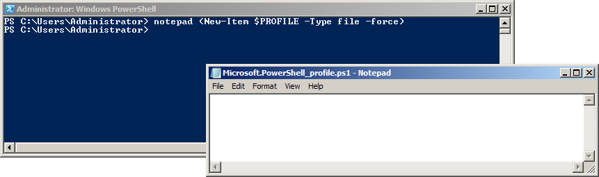

Everything that you add to this script will be executed when you launch a new instance of PowerShell.

----------

## Clipboard access (4) ##

In order to open the directory of the profile script you can enter:

	PS> explorer (Get-Item $PROFILE).Directory

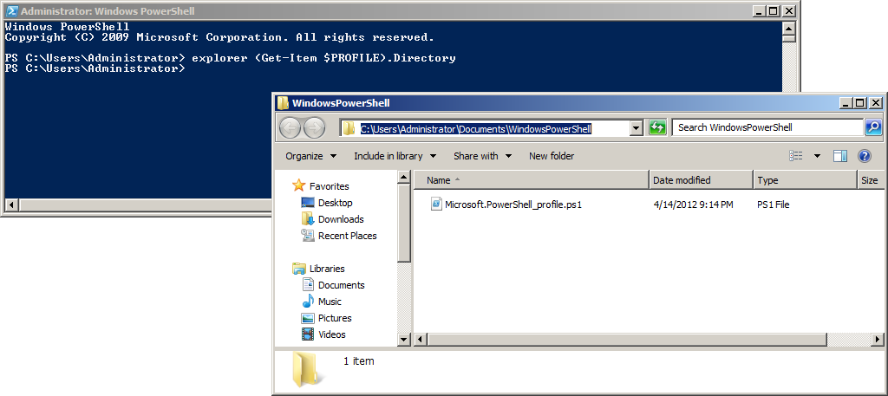

----------

## Clipboard access (5) ##

Now you can add the functions for reading and writing to and from the Windows Clipboard to your personal PowerShell profile:

	new-alias Out-Clipboard $env:SystemRoot\system32\clip.exe
	
	function Get-ClipboardText()
	{
		Add-Type -AssemblyName System.Windows.Forms
		$tb = New-Object System.Windows.Forms.TextBox
		$tb.Multiline = $true
		$tb.Paste()
		$tb.Text
	}

Start a new instance of PowerShell and verify that your functions have been applied correctly:

	PS> Get-Command *Clipboard*

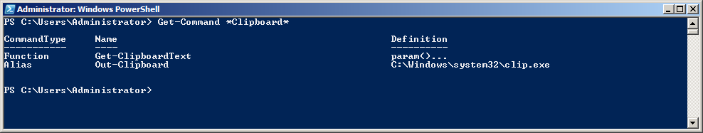

----------

## Clipboard access (6) ##
 
And now you can take your new functions “Get-ClipboardText” and “Out-Clipboard” out for a spin:

	PS> Get-Content $Profile | Out-Clipboard
	PS> dir | Out-Clipboard
	PS> Get-Process | Out-Clipboard

**Links**

- [The Windows PowerShell Profile](http://technet.microsoft.com/en-us/library/ee692764.aspx)
- [Copy and Paste with Clipboard from PowerShell](http://brianreiter.org/2010/09/03/copy-and-paste-with-clipboard-from-powershell/)
- [Using the New-Alias Cmdlet](http://technet.microsoft.com/en-us/library/ee176913.aspx)
- [Using the Add-Type Cmdlet](http://technet.microsoft.com/en-US/library/dd315241.aspx)
- [Using the New-Object Cmdled](http://technet.microsoft.com/en-US/library/dd315334.aspx)
- [The .NET TextBox Class](http://msdn.microsoft.com/en-us/library/system.windows.forms.textbox.aspx)
